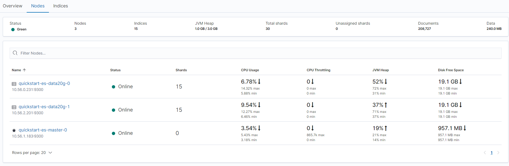
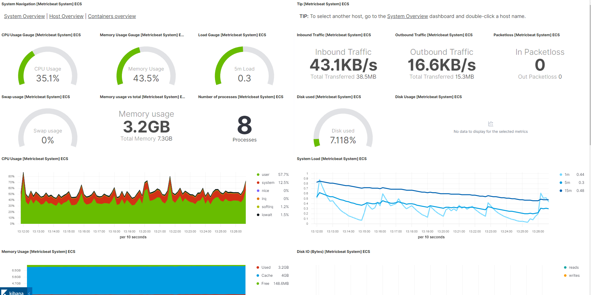
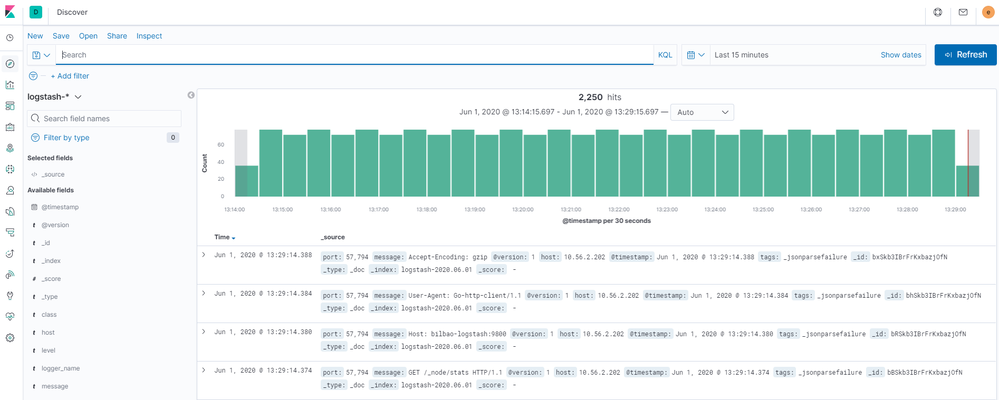
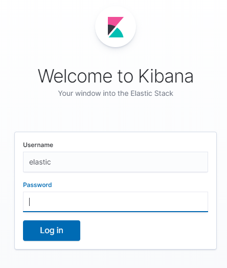
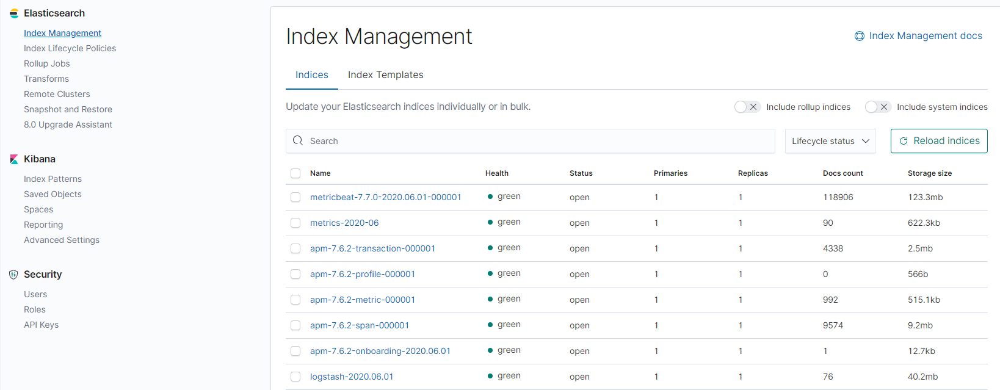
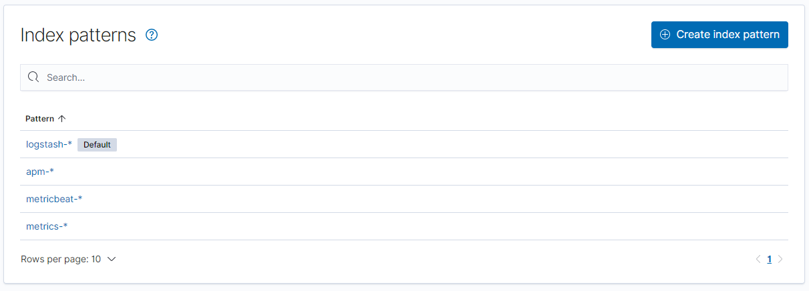
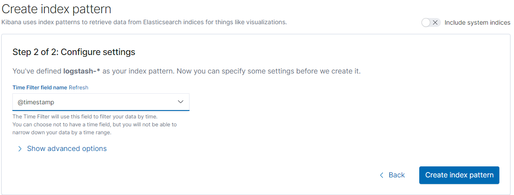
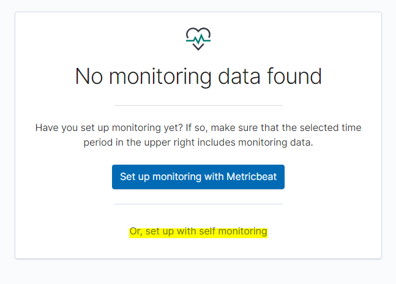

# elasticsearch full monitoring platform

This repo contains de source code for deploying full elasticstack + running application workload on a kubernetes cluster. You can do it step by step using provided helm charts, or deploy them all running the pulumi script. Yes, there is one line command to: 

```
docker run -v ${HOME}/.kube:/usr/multicloud/kube iiglesias/multicloud-sandbox:0.1.0
```

If you have a kubernetes cluster try it out







## Execute

### Pulumi

[Pulumi](https://www.pulumi.com/) is a modern IaC based on Hashicorp´s [Terraform](https://www.terraform.io/). 

Its mainly used for cloud provisioning but in this case we will be using just the kubernetes provider for deploying our stack on a given kube/config

You can access helm templates  https://github.com/iiglesiasg/helm-charts-repo 

To simply run the scrip you will need following tools:

- [Helm](https://helm.sh/docs/intro/install/) 
- [Pulumi](https://www.pulumi.com/docs/get-started/install/)
- [Nodejs](https://nodejs.org/es/download/)
- [kubectl](https://kubernetes.io/es/docs/tasks/tools/install-kubectl/) 

By default pulumi run the stack against your local .kube/config. Your config should be pointing the kubernetes cluster

You should login on pulumi and create your account. Then run: 

```
npm install ## for downloading pulumi´s libraries
pulumi login
pulumi up
```

An stack name may be required, type a name if prompted

It will preview the stack to be deployed and prompt for confirmation

You can destroy the stack deployed by running

```
pulumi destroy
```

### Docker

I made a docker image so you dont need to install so much tools.

Only needed is a kube/config pointing to the desired kubernetes cluster

Simply run:

```
docker run -v ${HOME}/.kube:/usr/multicloud/kube iiglesias/multicloud-sandbox:0.1.0
```

* Note that pulumi destroy is not implemented

The dockerfile is included in this repo. For pulumi´s stack status management I recommend creating your own dockerfile with your pulumi token


## WHAT IS DEPLOYED

### ECK

- elasticsearch database cluster
- elastic APM collector
- kibana 

### Elastic tools

- logstash
- MetricBeats
  - k8s
  - Infra
  - Mongo
  - elastic cluster health

### Application Workload

This workload is composed by 3 services  


SpringBoot services:

- logs: [logback](http://logback.qos.ch/) - [logstash appender](https://github.com/logstash/logstash-logback-encoder)
- Tracing: [Opentracing](https://opentracing.io/) + [elastic APM java agent](https://www.elastic.co/guide/en/apm/agent/java/1.x/index.html)
- Metrics: [Micrometer](https://micrometer.io/)

```
curl --header "Content-Type: application/json" --request POST http://{ADAPTER_IP}}:8090/MONADTST/testhttp -d @body.json
```

Where the body


```
{
    "adapter":{
            "msg": "adapter",
            "statusCode": 200,
            "delayMillis": 1,
            "encapsulateError" : false
    },
    "composite":{
            "msg": "composite",
            "statusCode": 200,
            "delayMillis": 200, 
            "encapsulateError" : false
    },
    "core": {
            "msg": "core",
            "statusCode": 200,
            "delayMillis": 3,
            "encapsulateError" : false
    }
}
```

delayMillis: For elastic APM inferred span

### Mongodb

Core service will perform insert and querys on a mongodb

### INGRESS-CONTROLLER + CERT-MANAGER

Just a minimal configuration for exposing the workload throught TLS by creating ingress manifest.

It is intended to serve [ACME](https://letsencrypt.org/es/) certificates once an fqdn is assigned to the [Nginx](https://www.nginx.com/). By default clusterIssuers will be created but only selfsigned certificates are issued.

```
sudo vi /etc/hosts
# Add load balancer´s ip for the ingress host spec
104.155.22.7	adapter.multicloud.inditex.com
```

```
curl -kv https://adapter.multicloud.inditex.com/MONADTST/amiga/healthcheck
```

```
apiVersion: networking.k8s.io/v1beta1
kind: Ingress
metadata:
  name: adapter-helm
  annotations:
    kubernetes.io/ingress.class: nginx
    cert-manager.io/cluster-issuer: selfsigning-issuer ## For a different clusterIssuer 
spec:
  tls:
  - hosts:
    - adapter.multicloud.inditex.com
    secretName: tls-secret
  rules:
  #- host: adapter.multicloud.inditex.com
  - http:
      paths:
      - backend:
          serviceName: adapter-helm
          servicePort: 8090
        path: /MONADTST
```

### Load Generator

Once the cluster is created a Kubernetes Job will perform load request to our demo workload.

This load Generator it is based on [Vegeta](https://github.com/tsenart/vegeta) and will be generating load (distributed traces) for the first 15 mins.

Base image was provided by  https://github.com/peter-evans/vegeta-docker 

## KIBANA

Not everything is automated, some instructions must be followed to make the full platform running

### Login

```
kubectl get secret quickstart-es-elastic-user -o yaml
## Decode the base64 value of elastic user
echo "OE1xNTJwVmkycEJvUlk0MXh5MjdlZDk0" | base64 -d
kubectl port-forward svc/quickstart-kb-http 5601:5601
```

Type https://localhost:5601 on your browser



- User: elastic
- password: ${DECODED_BASE64}


### Check elasticsearch index and reload them




### Create kibana index

- logstash-*
  - Application workload logs
- metrics-* 
  - Our application workload is using this index for Micrometer

[^]: MetricBeat and apm index are automatically created






### Stack Monitoring



Turn on monitoring as metricBeat is already configured


## ENJOY

- Add Nginx module to MetricBeat

  - MetricBeat configuration is stored in a configmap

- Try kibana lens new dashboard engine

- Update elasticsearch node count and storage size

  - update elasticsearch crd manifest

    ```
    kubectl edit elasticsearch
    ```

  - View changes on Kibana´s Stack Monitoring

